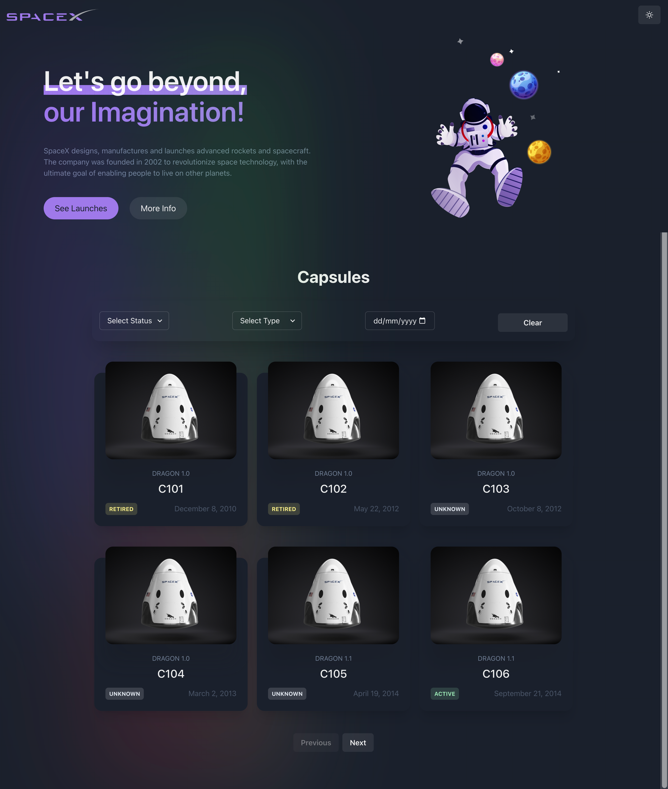
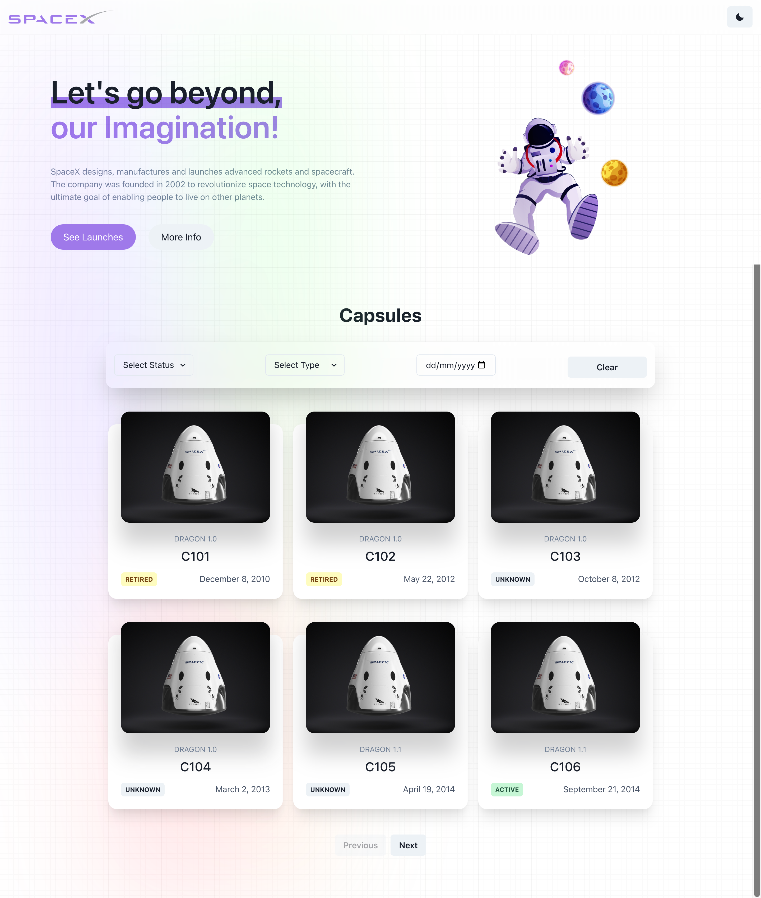
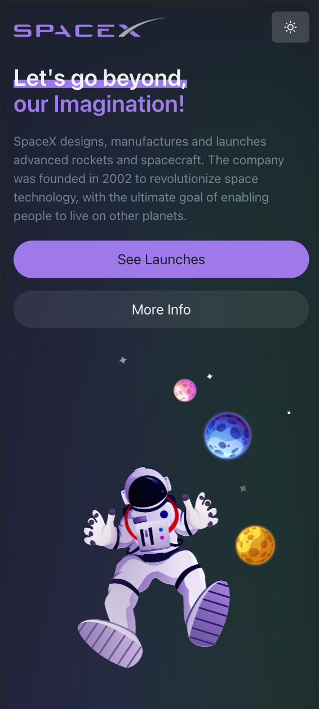
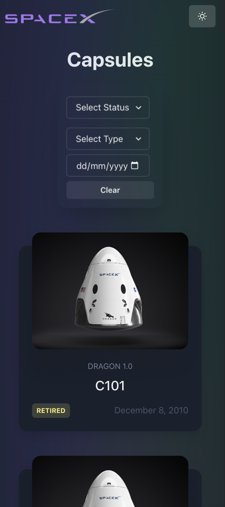
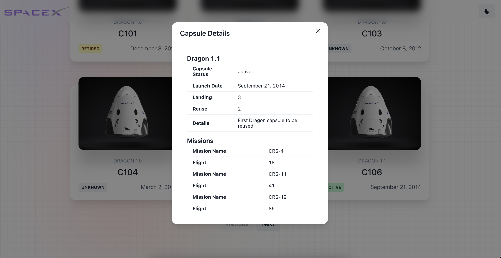

# SpaceX Capsules
## Description
This project is a simple web application that uses the SpaceX API to display information about the SpaceX capsules. The application is built using React and Redux. The application is responsive and works on mobile devices as well as desktops. The application is deployed on Vercel and can be accessed at https://spacexvz.vercel.app/.

This project is done for the assessment of brainstormforce.

## Installation
To run the application locally, clone the repository and run the following commands:
```
npm install
npm run dev
```
The application will be running on http://localhost:5173/.

## Usage
The application displays a list of capsules. The capsules can be filtered by the capsule status, capsule type, and capsule launch date. The capsules can be viewed in a card view.  The application can be viewed in a dark or light theme. The application is responsive and works on mobile devices as well as desktops.

## Technologies Used
* React
* Redux
* ChakraUI
* Vercel
## Video Demo
Click on the image below to view the video demo of the application.
[](https://www.youtube.com/watch?v=JHLob7H18So)


## Screenshots






## License
MIT License


